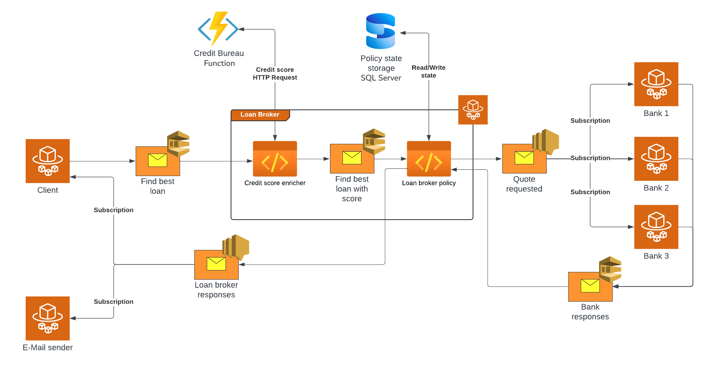

# Azure LoanBroker Showcase

The Azure LoanBroker showcase is a comprehensive loan broker implementation following the [structure presented](https://www.enterpriseintegrationpatterns.com/patterns/messaging/ComposedMessagingExample.html) by [Gregor Hohpe](https://www.enterpriseintegrationpatterns.com/gregor.html) in his [Enterprise Integration Pattern](https://www.enterpriseintegrationpatterns.com/) book.

> [!Note]
> The showcase runs locally using Docker, however, due to connection limitations with the Azure Service Bus Emulator, an Azure account is needed for the default setup. The [how to run the example](#how-to-run-the-example) section details how to configure the solution to connect to Azure services. A separate Docker Compose file is available for running the solution using the Azure Service Bus Emulator, but this is a cut down version of the showcase that does not demonstrate the full functionality of NServiceBus.

This is the logical architecture:


And this is how that is represented using Azure services running locally:



## What's in the box

The example is composed by:

- A client application, sending loan requests.
- A credit bureau providing the customers' credit score.
- A loan broker service that receives loan requests enriches them with credit scores and orchestrates communication with downstream banks.
- Three bank adapters, acting like Anti-Corruption layers (ACL), simulate communication with downstream banks offering loans.
- An email sender simulating email communication with customers.

The example also ships the following monitoring services:

- The Particular platform to monitor endpoints, capture and visualize audit messages, and manage failed messages.
- A Prometheus instance to collect, store, and query raw metrics data.
- A Grafana instance with three different metrics dashboards using Prometheus as the data source.
- A Jaeger instance to visualize OpenTelemetry traces.
- OpenTelemetry collector to collect and export metrics and traces to various destinations.

## Requirements

- .NET 10 or greater
- Docker
- Docker Compose

## How to run the example

The simplest way to run the example is using Docker for both the endpoints and the infrastructure.
The client application, the loan broker service, the e-mail sender, and the bank adapters can be deployed as Docker containers alongside the Particular platform to monitor the system, Azure Service Bus for messaging, SQL Server for persistence, and the additional containers needed for enabling OpenTelemetry observability.

Before running the complete example in Docker, create a local `.env` file from `.env.example` in the root folder and set `AZURE_SERVICE_BUS_CONNECTION_STRING` with your Azure Service Bus connection string.

> [!NOTE]
> The `.env` file is local only and should not be committed.

To run the complete example in Docker, execute the following command from the root folder:

The initial run will pull several containers required to run the demo. See [Ports](#ports) for the host ports these containers expose — make sure they are free before starting.

```shell
docker compose up --build -d
```

> [!TIP]
> Once the project is running, check out the [Things to try](#things-to-try) section.

The above command will build all projects, build container images locally, and start them. The Docker Compose command will also run and configure all the additional infrastructural containers.

To stop the running solution and remove all deployed containers. Using a command prompt, execute the following command:

```shell
docker compose down
```

To run the solution without rebuilding container images, execute the following command:

```shell
docker compose up -d
```

### Running with Azure Service Bus Emulator

To run the cut down version of the showcase with the Azure Service Bus Emulator, execute the following command from the root folder:

```shell
docker compose -f docker-compose-ASB-emulator.yml up --build -d
```

To stop the emulator-based solution and remove all deployed containers, execute the following command:

```shell
docker compose -f docker-compose-ASB-emulator.yml down
```

> [!NOTE]
> The emulator-based setup is a cut down version of the showcase and excludes Bank2 due to the Azure Service Bus Emulator connection limits. Microsoft has confirmed there are currently no plans to increase these limits: <https://github.com/Azure/azure-service-bus-emulator-installer/issues/58#issuecomment-2984760245>

### Running endpoints from the IDE

If you prefer to start the endpoints from your IDE to debug the code, execute the following command from a command prompt in the root directory to start the required infrastructure:

```shell
docker compose --profile infrastructure up -d
```

### Ports

The endpoint containers (Client, LoanBroker, Bank1/2/3, EmailSender) do not expose host ports — they communicate over Azure Service Bus. The infrastructure containers expose the following ports on the host. Make sure these are free before starting the demo.

#### Default setup (`docker-compose.yml`)

| Port  | Service                                       |
|-------|-----------------------------------------------|
| 1433  | SQL Server (NServiceBus persistence)          |
| 3000  | Grafana                                       |
| 4317  | OpenTelemetry Collector — OTLP gRPC           |
| 5318  | OpenTelemetry Collector — OTLP HTTP           |
| 1234  | OpenTelemetry Collector — Prometheus endpoint |
| 7071  | Credit Bureau (Azure Functions worker)        |
| 8080  | ServiceControl RavenDB Studio                 |
| 9090  | Prometheus                                    |
| 9999  | ServicePulse UI                               |
| 16686 | Jaeger UI                                     |
| 33333 | ServiceControl API                            |
| 33633 | ServiceControl Monitoring API                 |
| 44444 | ServiceControl Audit API                      |

#### Azure Service Bus Emulator setup (`docker-compose-ASB-emulator.yml`)

The emulator-based setup omits the Particular platform containers (ServiceControl, ServiceControl Audit, ServiceControl Monitoring, ServicePulse) and adds the emulator itself.

| Port  | Service                                       |
|-------|-----------------------------------------------|
| 1433  | SQL Server                                    |
| 3000  | Grafana                                       |
| 4317  | OpenTelemetry Collector — OTLP gRPC           |
| 5318  | OpenTelemetry Collector — OTLP HTTP           |
| 1234  | OpenTelemetry Collector — Prometheus endpoint |
| 5300  | Azure Service Bus Emulator (management)       |
| 5672  | Azure Service Bus Emulator (AMQP)             |
| 7071  | Credit Bureau                                 |
| 9090  | Prometheus                                    |
| 16686 | Jaeger UI                                     |

## Things to try

Once the project is running, here are some things to try. (Links are to `localhost` and will only work when the project is running.)

1. Explore some [traces in the Jaeger UI](http://localhost:16686/search?service=LoanBroker).
    - The green circles are traces where the entire flow completed successfully.
    - The red circles are traces that contain an exception at some point. (Bank3 fails 1/3 of the time.) Click into the failed steps and find the exception message and stack trace in the logs.
2. Check out a selection of [business metrics in Grafana](http://localhost:3000/d/edmhjobnxatc0c/loan-broker-demo?orgId=1&refresh=5s&from=now-15m&to=now&timezone=browser). (User `admin` and password `admin`.)
    - Some metrics are available for individual message types, even though the messages are processed from the same message queue.
    - Many more metrics are available by navigating to [Dashboards](http://localhost:3000/dashboards) and selecting a different dashboard.
3. Explore the [ServicePulse endpoint monitoring dashboard](http://localhost:9999/#/monitoring?historyPeriod=1), then navigate to [LoanBroker](http://localhost:9999/#/monitoring/endpoint/LoanBroker?historyPeriod=1) to see how these metrics are available for individual message types as well.
4. Investigate the EmailSender failures (the code is rigged to fail 5% of the time) in the [ServicePulse Failed Messages view](http://localhost:9999/#/failed-messages/failed-message-groups).
    - Navigate into the failed message group, then to an individual message.
    - Click on the tabs to see how the stack trace, message headers, and message body help a developer to troubleshoot and fix [systemic errors](https://particular.net/blog/but-all-my-errors-are-severe).
    - Return to the [failed message groups view](http://localhost:9999/#/failed-messages/failed-message-groups) and request a retry for the entire batch of failed messages.
    - The message handler will still fail 5% of the time. Click into the message group and see if there are any messages showing Retry Failures.

## Monitoring

The example comes with the [Particular platform](https://docs.particular.net/platform/), automatically available as Docker containers.

Monitoring information is available in [ServicePulse](http://localhost:9999).

## Telemetry

NServiceBus supports OpenTelemetry. Starting with NServiceBus 9.1, the following metrics are available:

- `nservicebus.messaging.successes` - Total number of messages processed successfully by the endpoint
- `nservicebus.messaging.fetches` - Total number of messages fetched from the queue by the endpoint
- `nservicebus.messaging.failures` - Total number of messages processed unsuccessfully by the endpoint
- `nservicebus.messaging.handler_time` - The time the user handling code takes to handle a message
- `nservicebus.messaging.processing_time` - The time the endpoint takes to process a message
- `nservicebus.messaging.critical_time` - The time between when a message is sent and when it is fully processed
- `nservicebus.recoverability.immediate` - Total number of immediate retries requested
- `nservicebus.recoverability.delayed` - Total number of delayed retries requested
- `nservicebus.recoverability.error` - Total number of messages sent to the error queue

For more information, refer to the [NServiceBus OpenTelemetry documentation](https://docs.particular.net/nservicebus/operations/opentelemetry).

All endpoints are configured to send OpenTelemetry traces to Jaeger. To visualize traces, open the [Jaeger dashboard](http://localhost:16686).

Similarly, endpoints send metrics to Prometheus. To visualize metrics, open the [Grafana dashboards](http://localhost:3000/dashboards). The default Grafana credentials are:

- Username: `admin`
- Password: `admin`

> [!NOTE]
> Setting a new password can be skipped. When containers are redeployed, the credentials are reset to their default values.

The example deploys three pre-configured Grafana dashboards:

- The [LoanBroker](http://localhost:3000/d/edmhjobnxatc0b/loanbroker?orgId=1&refresh=5s) dashboard shows various metrics about the business endpoints behavior, such as the differences between the services critical, processing, and handling time.
- The [Loan Broker Demo](http://localhost:3000/d/edmhjobnxatc0c/loan-broker-demo?orgId=1&refresh=5s) dashboard highlights a curated set of business metrics broken down by individual message type, useful for walking through the showcase.
- The [NServiceBus](http://localhost:3000/d/MHqYOIqnz/nservicebus?orgId=1&refresh=5s) dashboard shows the metrics related to message fetches, processing, and failures, grouped by endpoints or message type.

> [!NOTE]
> After running the solution multiple times, it might happen that Grafana suddenly shows random data instead of the expected metrics. To reset dashboards, tear down all containers and delete the `data-grafana` and `data-prometheus` folders from the solution folder. Redeploy the containers.
